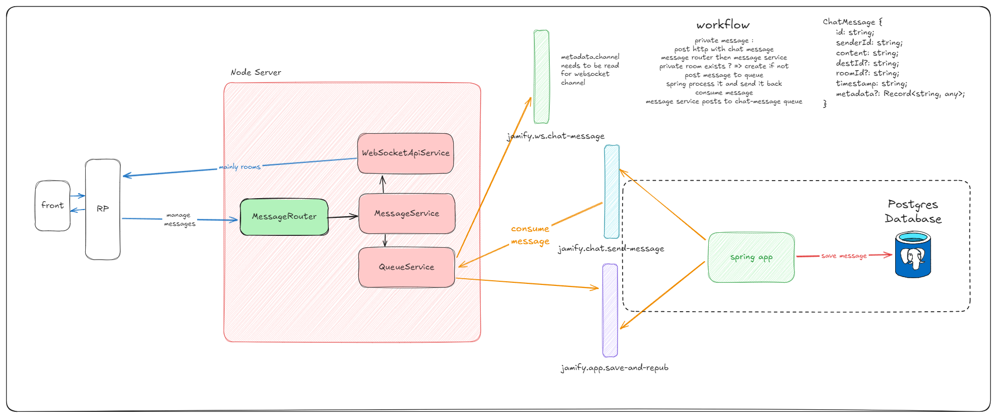

# jamify-chat


## Table of Contents

- [Introduction](#introduction)
- [Features](#features)
- [Requirements](#requirements)
- [Installation](#installation)
- [Configuration](#configuration)
- [Usage](#usage)
- [Contributing](#contributing)
- [License](#license)

## Introduction

Jamify Chat is a microservice handling chat for the Jamify application. It is built with Node.js, Express.js, Socket.io

## Features

- Real-time chat
- Receive messages from users HTTP requests
- Post them to a queue, read by Spring microservice handling storage (this last one repost them in another queue)
- Read messages from the queue and send them to the right user
- Manage connection and disconnection of users

## Requirements

- Node.js
- Express.js
- Socket.io
- ActiveMQ
- Docker

## Installation

1. Clone the repository:

    ```sh
    git clone 
    ```
2. Install the dependencies:

    ```sh
    npm install
    ```
   
3. Start the development server:

    ```sh
    npm run dev
    ```
   
4. Open your browser and navigate to `http://localhost:5173`.

## Configuration


## Usage

- `npm run dev`: Start the development server.
- `npm run start`: Start the production server.
- `npm run test`: Run the tests.

### TODO
Client needs to register by emitting a `register` event with the user's id. It will be saved in the redis database along with its socket id.

Then, it can send messages by sending a POST request to `/api/messages/send` with a ChatMessage Object in the body.

```typescript
export interface ChatMessage {
   id: string;
   senderId: string;
   content: string;
   destId?: string;
   roomId?: string;
   timestamp?: string;
   metadata?: Record<string, any>;
}
```

This server will post the message to the ActiveMQ queue, and the Spring microservice will read it and repost it to another queue. This server will read this queue and send the message through another queue that will be consumed by the websocket microservice.




## Contributing

Contributions are welcome! Please open an issue or submit a pull request.

## License

This project is licensed under the MIT License.